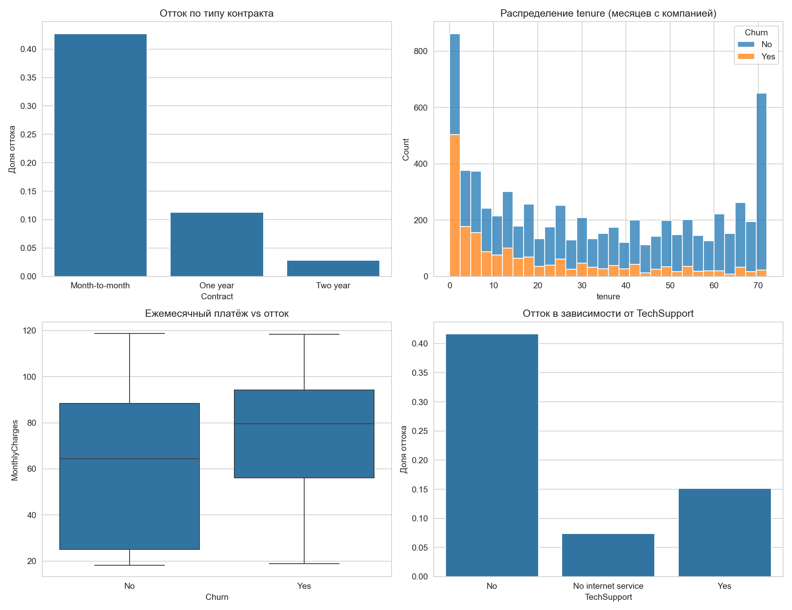
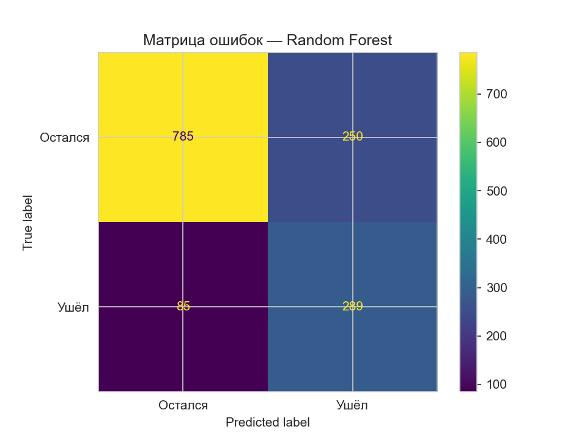
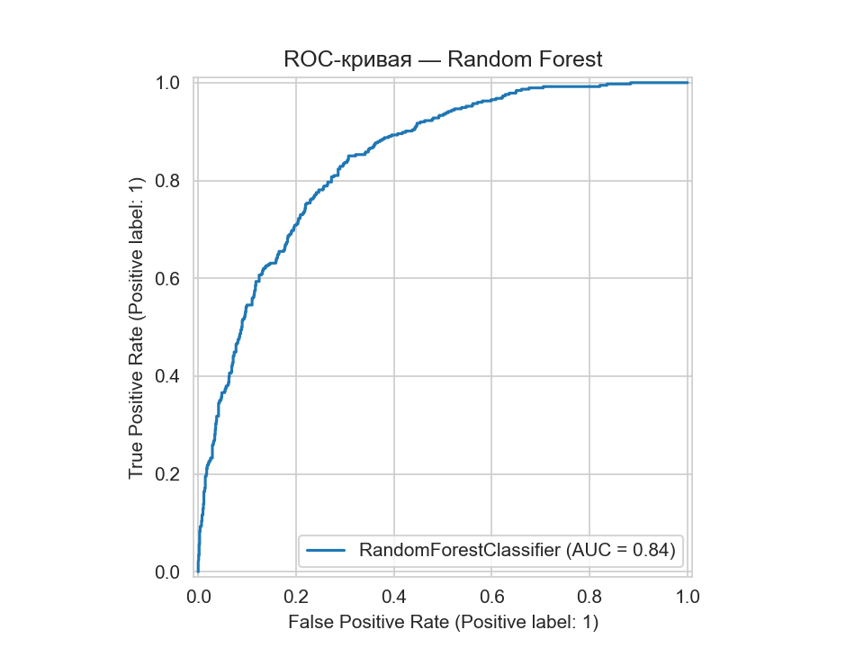
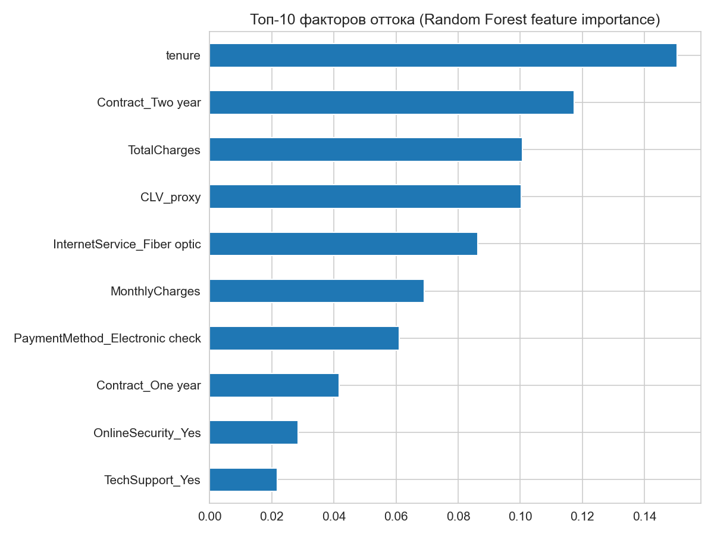

# Анализ оттока клиентов — Telco Customer Churn

Предсказание оттока клиентов телеком-компании и определение ключевых факторов риска
на основе исторических данных о 7043 клиентах.

## Задача

Отток клиентов (customer churn) — одна из самых дорогих проблем для подписочного бизнеса:
привлечение нового клиента обходится в разы дороже, чем удержание существующего.
Цель проекта — построить модель, которая заранее выявляет клиентов с высоким риском
ухода, и дать бизнесу конкретные рекомендации по удержанию.

## Данные

**Telco Customer Churn (IBM)** — [Kaggle, blastchar/telco-customer-churn](https://www.kaggle.com/datasets/blastchar/telco-customer-churn)

- 7043 клиента, 21 признак
- Целевая переменная: `Churn` (Yes/No)
- Признаки: демография, тип контракта, подключённые услуги (интернет, ТВ, техподдержка),
  способ оплаты, tenure (месяцев с компанией), ежемесячный и суммарный платёж

## Инструменты

SQL (SQLite) — для формулировки бизнес-вопросов в виде запросов
Python — Pandas, scikit-learn (Logistic Regression, Random Forest), Matplotlib/Seaborn

## Разведочный анализ (EDA)



- **Тип контракта — главный видимый фактор риска.** Отток на помесячном контракте
  (`Month-to-month`) составляет около **43%**, тогда как на двухгодичном — около **3%**.
  Разница более чем в 14 раз.
- **Критическая точка — первые месяцы обслуживания.** Наибольшая концентрация ушедших
  клиентов приходится на `tenure` от 0 до ~10 месяцев; далее доля оттока стабильно падает.
- **Отсутствие технической поддержки коррелирует с оттоком.** Среди клиентов без
  `TechSupport` отток заметно выше, чем среди тех, кто эту услугу подключил.
- **Ежемесячный платёж у ушедших клиентов в среднем выше** (медиана ~80 у.е. против ~65 у.е.
  у оставшихся) — более дорогие тарифы связаны с повышенным риском ухода.

## Модель

Обучены две модели для сравнения:

| Модель | Зачем | Особенность |
|---|---|---|
| Logistic Regression | Baseline, интерпретируемая | Коэффициенты объяснимы бизнесу напрямую |
| Random Forest | Финальная модель | Выше качество, есть feature importance |

### Результаты (Random Forest, тестовая выборка — 1409 клиентов)




| Метрика | Значение | Что значит |
|---|---|---|
| **ROC-AUC** | **0.84** | Хорошее качество разделения классов (0.5 — случайно, 1.0 — идеально) |
| **Accuracy** | 0.76 | Доля верных прогнозов в целом |
| **Precision (Churn)** | 0.54 | Из тех, кого модель назвала "уйдёт", реально ушли 54% |
| **Recall (Churn)** | **0.77** | Модель нашла 77% реально ушедших клиентов (289 из 374) |

**Почему Recall важнее Accuracy в этой задаче:** база несбалансирована — уходит только
~27% клиентов. Модель, всегда предсказывающая "останется", дала бы accuracy ~73%, но не
нашла бы ни одного клиента из группы риска. Recall = 0.77 означает, что бизнес получает
возможность заранее связаться почти с тремя из четырёх клиентов, которые иначе бы ушли
незамеченными. Цена этого — 250 ложных срабатываний (клиентов, ошибочно отмеченных как
"риск"), что приемлемо, если стоимость удерживающего предложения ниже стоимости потери
клиента.

## Ключевые факторы оттока



Топ-факторы по важности (Random Forest feature importance):

1. **tenure** — длительность обслуживания клиента (самый сильный предиктор)
2. **Contract_Two year** — наличие двухгодичного контракта резко снижает риск
3. **TotalCharges** / **CLV_proxy** — накопленная сумма платежей клиента
4. **InternetService_Fiber optic** — оптоволоконный интернет связан с повышенным оттоком
5. **MonthlyCharges** — размер ежемесячного платежа
6. **PaymentMethod_Electronic check** — оплата через electronic check связана с более высоким оттоком, чем автоплатёж

## Выводы и рекомендации

1. **Стимулировать переход с помесячного на годовой/двухгодичный контракт.**
   Разница в оттоке (43% против 3%) — самый управляемый рычаг из всех найденных.
   Предложение бонуса за переход на длительный контракт в первые месяцы обслуживания
   способно дать наибольший эффект на удержание.

2. **Усилить онбординг в первые месяцы.** Пик оттока приходится на ранний период —
   стоит внедрить проактивные касания (звонок, письмо, персональное предложение)
   именно в первые 1–3 месяца обслуживания.

3. **Продвигать TechSupport и OnlineSecurity как часть удержания**, а не только как
   платную опцию — вовлечённость в дополнительные сервисы снижает вероятность ухода.

4. **Проверить качество оптоволоконного интернета (Fiber optic).** Связь этого признака
   с оттоком может указывать на проблемы качества или цены услуги — стоит отдельное
   расследование причин, а не только статистическая корреляция.

5. **Стимулировать переход на автоплатёж** вместо electronic check — снижает трение
   при оплате и, возможно, отсекает менее лояльный сегмент.


## Как запустить

```bash
pip install -r requirements.txt
python notebooks/churn_analysis.py
```

Требуется файл `data/telco_churn.csv` (скачивается с Kaggle, см. раздел «Данные»).

## Структура репозитория

```
churn-analysis/
├── data/
│   └── telco_churn.csv
├── sql/
│   └── churn_analysis.sql
├── notebooks/
│   └── churn_analysis.py
├── images/
│   ├── eda_overview.png
│   ├── confusion_matrix.png
│   ├── roc_curve.png
│   └── feature_importance.png
├── README.md
└── requirements.txt
```
