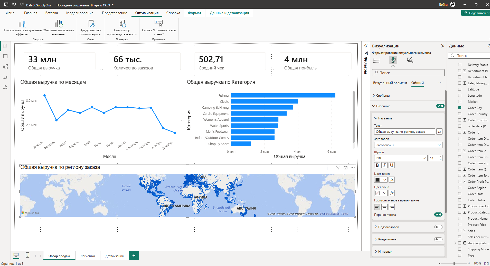
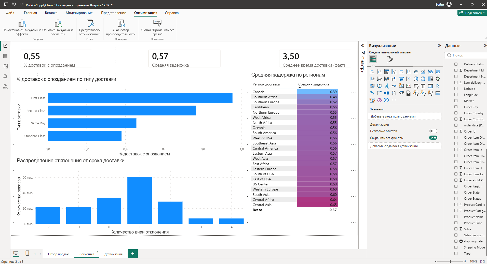
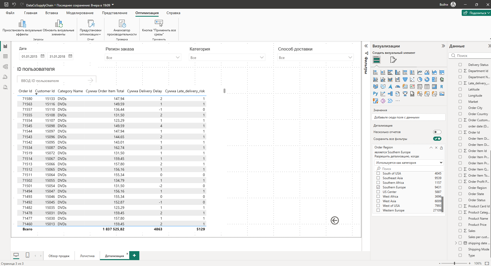

# Дашборд по продажам и логистике — Power BI

Интерактивный дашборд на 3 страницах для анализа продаж и логистики компании на основе
датасета DataCo Smart Supply Chain: обзор продаж, эффективность доставки и детализация
по конкретным заказам с drillthrough-переходами.

## Данные

**DataCo Smart Supply Chain for Big Data Analysis** — Kaggle
Транзакционные данные о заказах, доставках и продажах интернет-магазина спорттоваров.

## Инструменты

Power BI Desktop — Power Query (очистка данных), модель данных со связанной таблицей-календарём,
DAX-меры, условное форматирование, drillthrough-переходы между страницами.

---

## Страница 1 — Обзор продаж



**Ключевые показатели:**

| Метрика | Значение |
|---|---|
| Общая выручка | 33 млн |
| Количество заказов | 66 тыс. |
| Средний чек | 502,71 |
| Общая прибыль | 4 млн |

**Динамика по месяцам:** выручка держится в диапазоне 2,5–3,0 млн большую часть года,
с заметным пиком в январе (~3,0 млн) и последующим спадом в феврале. В ноябре-декабре
наблюдается устойчивое снижение — выручка падает к концу года до нижней границы диапазона.

**Топ категорий по выручке:** лидирует категория **Fishing**, за ней следуют **Cleats**
и **Camping & Hiking**. Категории **Shop By Sport** и **Indoor/Outdoor Games** формируют
нижнюю часть топ-10 — разрыв между первой и последней категорией в списке заметный,
что говорит о концентрации продаж в нескольких ключевых товарных группах.

**География продаж:** карта показывает продажи практически по всему миру, с визуально
плотными зонами в Северной Америке и Европе.

---

## Страница 2 — Логистика и доставка



**Ключевые показатели:**

| Метрика | Значение |
|---|---|
| % доставок с опозданием | 55% |
| Средняя задержка | 0,57 дня |
| Среднее время доставки (факт) | 3,50 дня |

**Опоздания по типу доставки** — обнаружена контринтуитивная закономерность:
**First Class** и **Second Class** (более быстрые/дорогие способы доставки) показывают
заметно **больший** процент опозданий, чем **Standard Class**. Same Day и Standard Class
держат наименьший процент задержек среди всех способов.

➡️ Это указывает на возможный разрыв между обещанным сроком (SLA) для ускоренной доставки
и фактическими логистическими возможностями — компания, вероятно, обещает клиентам более
короткие сроки при экспресс-доставке, чем может стабильно обеспечить.

**Распределение отклонения от срока доставки:** пик распределения приходится на **+1 день**
(около 58 тыс. заказов) — то есть типичный сценарий не "доставили точно в срок", а "опоздали
на день". Заметная часть заказов (в районе 20 тыс.) доставляется на 1-2 дня **раньше** плана,
и есть небольшой, но не нулевой хвост опозданий на 3-4 дня.

**Средняя задержка по регионам** (от лучших к худшим):

| Регион | Средняя задержка |
|---|---|
| Canada (лучший) | 0,39 |
| Southern Africa | 0,48 |
| Southern Europe | 0,52 |
| ... | ... |
| Western Europe | 0,60 |
| South Asia | 0,60 |
| Central Africa | 0,64 |
| **Central Asia (худший)** | **0,65** |

Разброс между лучшим и худшим регионом (0,39 против 0,65) — почти двукратный, при общем
среднем 0,57. Это значит, что проблема с задержками не равномерна по всей сети, а
концентрируется в конкретных регионах — прежде всего в Central Asia и Central Africa.

---

## Страница 3 — Детализация (с drillthrough)



Страница демонстрирует drillthrough-переход: клик по региону **Southern Europe** на
странице "Логистика" переносит сюда с автоматическим фильтром именно по этому региону.

**Пример: срез по Southern Europe** (9 431 заказ по региону, судя по подсчёту в панели фильтров):

| Метрика (только Southern Europe) | Значение |
|---|---|
| Сумма Order Item Total | 1 837 525,82 |
| Сумма Delivery Delay | 4 863 |
| Сумма Late_delivery_risk | 5 129 |

Также на странице доступны срезы по дате, региону, категории и способу доставки, и
поле ввода для поиска по ID пользователя — можно детализировать до конкретного заказа.

---

## Ключевые находки

1. **Экспресс-доставка опаздывает чаще, чем стандартная.** First Class и Second Class
   показывают более высокий процент опозданий, чем Standard Class и Same Day — это
   нелогично с точки зрения ожиданий клиента и требует отдельного расследования причин
   (нереалистичные SLA, недостаточные мощности под пиковый спрос на экспресс-доставку).

2. **Типичное опоздание — не катастрофа, а один день.** Основная масса задержек
   сосредоточена в диапазоне +1 день, а не в длинном хвосте многодневных срывов —
   это значит, что проблема системная и небольшая по величине, а не единичные грубые сбои.

3. **География задержек неравномерна.** Регионы Central Asia и Central Africa отстают
   от Canada и Southern Africa почти в 1,7 раза по средней задержке — точечная проверка
   логистических партнёров в этих регионах может дать быстрый эффект.

4. **Выручка проседает к концу года.** Заметное снижение в ноябре-декабре — стоит
   сопоставить с сезонностью категории Fishing (основной источник выручки), возможно,
   товар сезонный и требует диверсификации ассортимента на низкий сезон.

## Рекомендации

1. Пересмотреть заявленные сроки (SLA) для First Class и Second Class — либо увеличить
   мощности логистики под эти способы доставки, либо скорректировать обещания клиентам.
2. Провести точечный аудит логистических партнёров в Central Asia и Central Africa —
   именно там сосредоточен наибольший риск задержки.
3. Проверить сезонность категории Fishing и рассмотреть кросс-продажи смежных категорий
   (Camping & Hiking, Cardio Equipment) в период спада продаж основной категории.

## Ограничения анализа

- Средняя задержка может маскировать выбросы — регион с "средней" задержкой 0,55
  может содержать как много небольших опозданий, так и малую долю очень крупных;
  для более точного вывода стоит смотреть не только на среднее, но и на 90-й перцентиль
  задержки по регионам.
- Данные охватывают фиксированный исторический период — дашборд показывает "как было",
  а не прогноз на будущее.

## Как открыть

Откройте `.pbix` файл в Power BI Desktop (бесплатно, только Windows). Для просмотра без
установки — см. приложенные скриншоты выше.

## Структура репозитория

```
powerbi-dashboard/
├── dashboard.pbix
├── images/
│   ├── page1_overview.png
│   ├── page2_logistics.png
│   └── page3_detail.png
└── README.md
```
