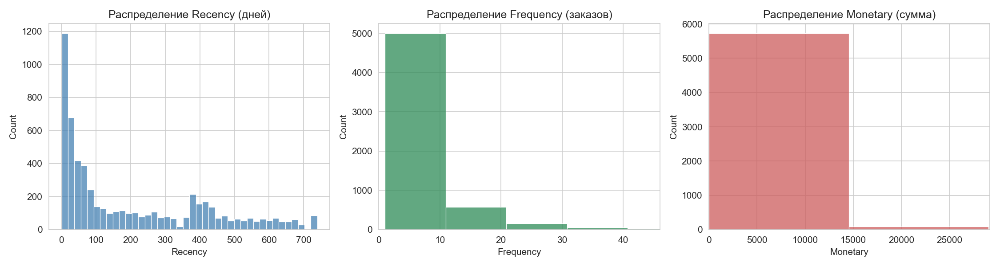
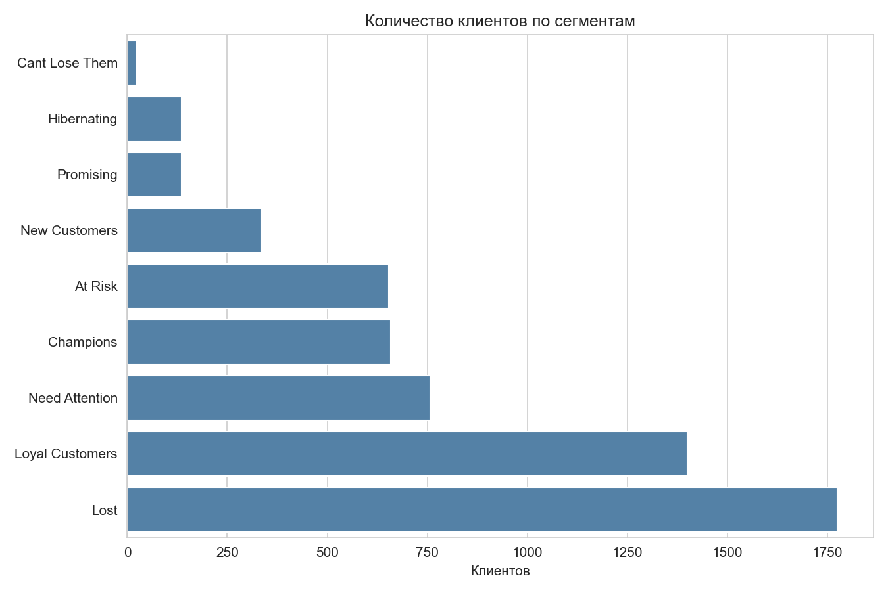
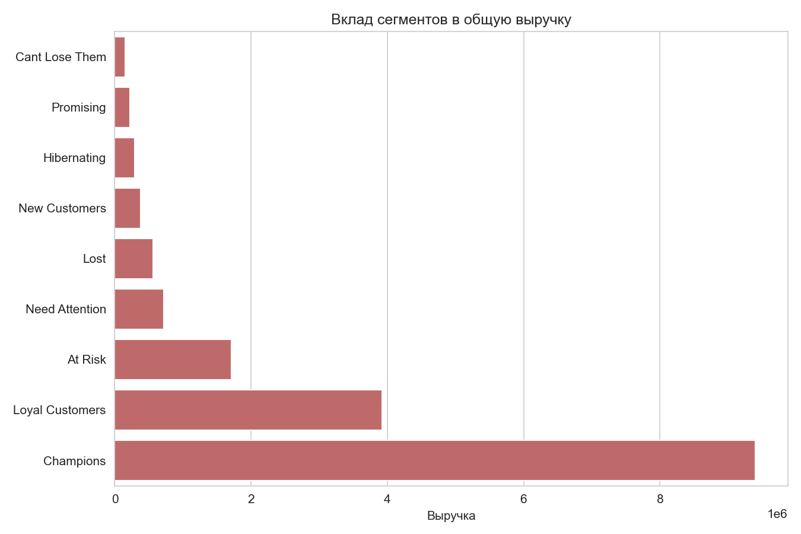

# RFM-сегментация клиентской базы — Online Retail II

RFM-анализ клиентской базы интернет-магазина: сегментация по давности, частоте и сумме
покупок, с конкретными рекомендациями по работе с каждым сегментом.

## Задача

Разделить клиентскую базу на однородные группы по покупательскому поведению, чтобы
маркетинг мог работать точечно: удерживать лучших клиентов, реактивировать спящих,
не тратить бюджет на тех, кто уже потерян.

## Данные

**Online Retail II** — UCI Machine Learning Repository / Kaggle
Транзакции британского интернет-магазина подарков, 2009–2011. После очистки (удалены
отменённые заказы, строки без ID клиента, служебные записи) — **5 878 уникальных клиентов**.

## Методология

RFM по квартилям (`pd.qcut`, 4 группы на метрику), с явным присвоением бизнес-понятных
названий сегментов — Champions, Loyal Customers, At Risk,
Lost и другие. Подробная методология и код — в `notebooks/rfm_analysis.py`.

---

## Распределения метрик



- **Recency:** основная масса клиентов покупала совсем недавно (пик в диапазоне 0-50 дней),
  но заметен и локальный "горб" в районе 380-420 дней. Проверено: все 380 клиентов
  из этого диапазона (100% без исключений) совершили последнюю покупку именно в 2010 году —
  это подтверждает, что горб объясняется структурой датасета: клиенты, активные только
  в первый период данных (2009-2010) и не вернувшиеся в 2011 году, закономерно образуют
  отдельную группу с Recency около 365+ дней относительно точки отсчёта анализа.
- **Frequency:** сильно смещено вправо — подавляющее большинство клиентов сделали от
  1 до 10 заказов, и лишь незначительная часть — свыше 20-30 заказов.
- **Monetary:** аналогично смещено вправо — основная масса клиентов тратит небольшие суммы,
  ось намеренно обрезана по 99-му перцентилю, чтобы единичные крупные покупатели
  не "сжимали" график для всех остальных.

## Размер сегментов



| Сегмент | Клиентов | % от базы | Средний Recency | Средняя Frequency |
|---|---|---|---|---|
| Lost | 1 776 | 30,2% | 419,0 дней | 1,4 |
| Loyal Customers | 1 400 | 23,8% | 39,1 дней | 7,5 |
| Need Attention | 758 | 12,9% | 242,9 дней | 2,4 |
| Champions | 659 | 11,2% | 10,4 дней | 24,5 |
| At Risk | 654 | 11,1% | 212,7 дней | 6,9 |
| New Customers | 336 | 5,7% | 13,7 дней | 1,9 |
| Promising | 136 | 2,3% | 58,6 дней | 2,3 |
| Hibernating | 135 | 2,3% | 226,9 дней | 2,2 |
| Cant Lose Them | 24 | 0,4% | 476,5 дней | 14,2 |

## Вклад сегментов в выручку



| Сегмент | % от базы | Суммарная выручка | % от выручки |
|---|---|---|---|
| **Champions** | **11,2%** | **9 404 590** | **54,1%** |
| Loyal Customers | 23,8% | 3 924 940 | 22,6% |
| At Risk | 11,1% | 1 712 670 | 9,9% |
| Need Attention | 12,9% | 719 148 | 4,1% |
| Lost | 30,2% | 565 316 | 3,3% |
| New Customers | 5,7% | 380 990 | 2,2% |
| Hibernating | 2,3% | 289 608 | 1,7% |
| Promising | 2,3% | 221 582 | 1,3% |
| Cant Lose Them | 0,4% | 155 953 | 0,9% |
| **Итого** | **100%** | **17 374 797** | **100%** |

---

## Ключевые находки

1. **Классическое правило 80/20 подтверждается почти буквально.** Champions — всего 11,2%
   клиентской базы (659 человек) — приносят **54,1% всей выручки** (9,4 млн из 17,4 млн).
   Это самый концентрированный и самый ценный сегмент, требующий приоритетной защиты
   от оттока. Средний Recency у них — всего 10,4 дня, Frequency — 24,5 заказа: это
   активные, вовлечённые клиенты прямо сейчас, а не "бывшие хорошие".

2. **Почти треть базы (30,2%, 1 776 человек) — это уже потерянные клиенты (Lost)**,
   но их вклад в выручку — всего 3,3%. Средний Recency у них — 419 дней (больше года
   без покупок), а Frequency — 1,4 заказа, то есть в среднем это клиенты, купившие
   один раз и не вернувшиеся. Тратить на них дорогой персонализированный маркетинг
   нерационально.

3. **Loyal Customers — вторая по значимости опора бизнеса**: 23,8% клиентов и 22,6%
   выручки — пропорция почти "один к одному", в отличие от Champions, где маленькая
   группа даёт непропорционально много.

4. **At Risk — сегмент с наибольшим потенциалом быстрого эффекта.** 654 клиента (11,1%
   базы) уже принесли 9,9% выручки (1,7 млн), а средний Recency у них — 212,7 дня
   (около 7 месяцев без покупок) при Frequency 6,9 заказа — то есть это не случайные
   разовые покупатели, а клиенты с историей, которые начали затихать, но ещё не потеряны
   окончательно, в отличие от Lost.

5. **Cant Lose Them — крошечный (0,4%, всего 24 клиента), но статистически особенный
   сегмент.** У них самый высокий средний Recency среди всех (476,5 дня — дольше, чем
   даже у Lost!), но при этом вторая по величине средняя Frequency (14,2 заказа) после
   Champions. Это клиенты, которые были очень активны в прошлом, но не покупали дольше
   всех остальных сегментов — риск их полной потери самый высокий по срочности, несмотря
   на маленький размер группы.

6. **"Горб" в распределении Recency (380-420 дней) — не аномалия поведения клиентов,
   а особенность структуры данных.** Проверка показала: все 380 клиентов в этом
   диапазоне (100%) совершили последнюю покупку в 2010 году. Датасет охватывает
   2009-2011 годы, и клиенты, не вернувшиеся после 2010-го, механически попадают
   в этот диапазон Recency относительно точки отсчёта анализа. Из 5 878 клиентов
   последняя покупка приходится на 2009 год лишь у 100 человек, на 2010 — у 1 598,
   на 2011 — у 4 244: это подтверждает, что "горб" — не сигнал о поведении клиентов,
   а технический артефакт временных границ датасета.

## Рекомендации бизнесу

1. **Champions** (659 клиентов, 54,1% выручки) — не давать скидок,
   а предлагать привилегии: ранний доступ к новинкам, эксклюзивные позиции, персональный
   менеджер. Цель — не стимулировать разовую покупку, а закрепить статус. Учитывая, что
   этот сегмент даёт больше половины всей выручки компании, даже небольшой отток отсюда
   ощутим сильнее, чем полная потеря нескольких менее ценных сегментов вместе взятых.

2. **At Risk** (654 клиента, 1,7 млн исторической выручки) — приоритетная реактивационная
   кампания в ближайшее время: 212 дней без покупки — это ещё окно возможностей, а не
   потерянный случай. Это сегмент с лучшим соотношением "затраты на возврат / потенциальная
   выручка" среди всех невовлечённых групп.

3. **Cant Lose Them** (24 клиента) — несмотря на маленький размер, требует немедленного
   персонального подхода (не массовой рассылки, а точечного звонка или именного
   предложения) — высокая историческая Frequency (14,2) показывает, что это были
   действительно ценные клиенты, а рекордный Recency (476,5 дня) означает, что
   промедление увеличивает риск их безвозвратной потери.

4. **Lost** (1 776 клиентов, но только 3,3% выручки) — исключить из дорогих платных
   каналов маркетинга; если реактивировать, то только дешёвыми массовыми методами
   (email с низкой частотой рассылки).

5. **New Customers / Promising** (336 + 136 = 472 клиента) — выстроить онбординг-цепочку,
   направленную на доведение до второй-третьей покупки: у New Customers средняя Frequency
   всего 1,9 — именно на этом этапе решается, скатится ли клиент в Lost или перейдёт
   в Loyal Customers.

## Ограничения анализа

- Разбивка по квартилям (`pd.qcut`) означает, что границы сегментов зависят от
  распределения именно этой клиентской базы — доля "Champions" (11,2%) не универсальна
  и изменится на других данных.
- Правило разбивки на сегменты (функция `assign_segment`) — авторский способ группировки на
  основе стандартной RFM-методологии;
  на практике границы условий можно калибровать под конкретные бизнес-цели.
- Датасет объединяет два годовых периода (2009-2010 и 2010-2011) — Recency у части
  клиентов искусственно завышен просто в силу устройства данных, а не обязательно
  говорит о реальном угасании интереса к бренду. При работе с живыми, непрерывно
  обновляемыми данными этой особенности не будет.


## Как запустить

```bash
pip install -r requirements.txt
python notebooks/rfm_analysis.py
```

## Структура репозитория

```
rfm-segmentation/

├── notebooks/
│   └── rfm_analysis.py
├── images/
│   ├── rfm_distributions.png
│   ├── segment_sizes.png
│   └── segment_revenue.png
├── segment_summary.csv
├── README.md
└── requirements.txt
```
